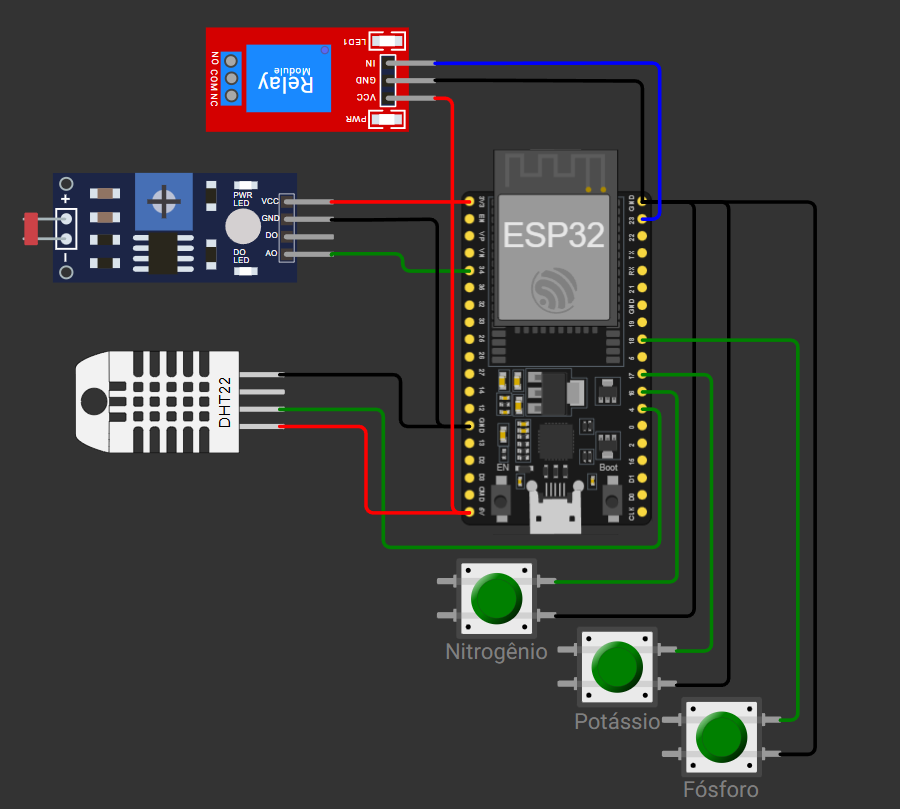

# FIAP - Faculdade de Informática e Administração Paulista

<p align="center">
<a href= "https://www.fiap.com.br/"></a>
</p>

<br>

# Startup FarmTech Solutions

## Grupo H.M.N.R.V.

## 👨‍🎓 Integrantes: 
- <a href="https://github.com/NeuralXP">Heitor Exposito de Sousa</a>
- <a href="https://github.com/MarcoR-S">Marco Antônio Rodrigues Siqueira</a>
- <a href="https://github.com/nadnakvie">Nádia Nakamura Vieira</a> 
- <a href="https://github.com/optimizasavings-byte">Rafael Bassani</a> 
- <a href="https://github.com/ViniciusX22">Vinicius Xavier da Silva</a>

## 📜 Descrição

Este repositório consolida as entregas do projeto FarmTech Solutions em duas fases complementares:

- **Fase 1 (Python + R):** gestão de plantio, cálculos agronômicos e análise de dados.
- **Fase 2 (ESP32 + Wokwi):** coleta simulada de dados NPK/pH/umidade e automação da irrigação.

## 🌱 Fase 1 - Gestão agrícola (Python + R)

### Objetivo

Implementar um sistema de apoio à decisão para culturas de **soja** e **café**, com cálculo de área, estimativa de insumos e análises estatísticas.

### Arquivos principais

- `src/fase_1/cap_1/menu_principal.py`
- `src/fase_1/cap_1/estatisticas_basicas.r`
- `src/fase_1/cap_1/previsao_do_tempo.r`
- `dados_plantio.csv`

### Execução

```bash
cd farmtech-solutions
pip install -r requirements.txt
cd src/fase_1/cap_1
python menu_principal.py
```

Requisitos: Python 3.10+, pandas e R com `Rscript` no PATH.

## 💧 Fase 2 - Campo da Inovação

### Cap 1 - Irrigação Inteligente (ESP32 + Wokwi)

Simular um sistema IoT de irrigação que liga a bomba (relé) apenas quando as condições de NPK, pH e umidade estiverem adequadas para a cultura ativa.

### Cap 6 - Python e além (Oracle + Agroneg chosen)

Sistema de gestão do agroneg chosen com Python, conexão Oracle e estruturas de dados.

### Cap 7 - Ciências de Dados (R + Excel)

Análise estatística de dados do agroneg com R, incluindo medidas de tendência central, dispersão e separatrizes.

### Componentes simulados

- **N, P e K:** 3 botões verdes (estado binário pressionado/não pressionado)
- **pH do solo:** LDR (conversão analógica para escala 0-14)
- **Umidade do solo:** DHT22 (proxy didático)
- **Bomba:** relé

### Imagem do circuito



### Arquivos principais

- `src/fase_2/cap_1/irrigacao.ino` (firmware ESP32)
- `diagram.json` (circuito Wokwi)
- `platformio.ini` (build/configuração)

### Mapeamento de pinos (ESP32)

| Componente | GPIO |
|---|---:|
| Botão Nitrogênio (N) | 16 |
| Botão Potássio (K) | 17 |
| Botão Fósforo (P) | 18 |
| LDR (AO) | 34 |
| DHT22 (DATA) | 4 |
| Relé (IN) | 23 |

### Lógica de irrigação

Os parâmetros por cultura foram definidos da seguinte forma:

### Soja
- pH: 6.0 a 7.0
- Umidade mínima: 60%
- Umidade máxima (referência): 80%

### Café
- pH: 5.5 a 6.5
- Umidade mínima: 70%
- Umidade máxima (referência): 80%

Conversão de pH (via LDR):

`pH = (leituraAnalogica / 4095.0) * 14.0`

Regra de acionamento da bomba:

`irrigar = (umidade < umidade_minima) AND (ph_minimo <= pH <= ph_maximo) AND (N AND P AND K)`

### Execução via VS Code (recomendada)

Fluxo principal para simular e testar o circuito sem depender de CLI:

1. Instalar a extensão **Wokwi Simulator** no VS Code.
2. Instalar a extensão **PlatformIO IDE** no VS Code.
3. Abrir este repositório no VS Code.
4. Usar a extensão para compilar e executar a simulação no Wokwi.
5. Acompanhar o Serial Monitor e validar o acionamento do relé alterando N/P/K, LDR e DHT22.

### Execução via CLI

Se você preferir linha de comando, também é possível usar o PlatformIO Core via CLI:

```bash
cd farmtech-solutions
pio run
```

Comandos úteis:

```bash
# Upload para placa física
pio run -t upload

# Monitor serial
pio device monitor -b 115200
```

Requisito adicional para CLI (opcional): `platformio` disponível no ambiente Python.

## 🗃 Histórico de lançamentos

* 0.3.0 - 22/03/2026
* 0.2.0 - 12/03/2026
* 0.1.0 - 07/03/2026

## 📋 Licença

<p xmlns:cc="http://creativecommons.org/ns#" xmlns:dct="http://purl.org/dc/terms/"><a property="dct:title" rel="cc:attributionURL" href="https://github.com/agodoi/template">MODELO GIT FIAP</a> por <a rel="cc:attributionURL dct:creator" property="cc:attributionName" href="https://fiap.com.br">Fiap</a> está licenciado sobre <a href="http://creativecommons.org/licenses/by/4.0/?ref=chooser-v1" target="_blank" rel="license noopener noreferrer" style="display:inline-block;">Attribution 4.0 International</a>.</p>


