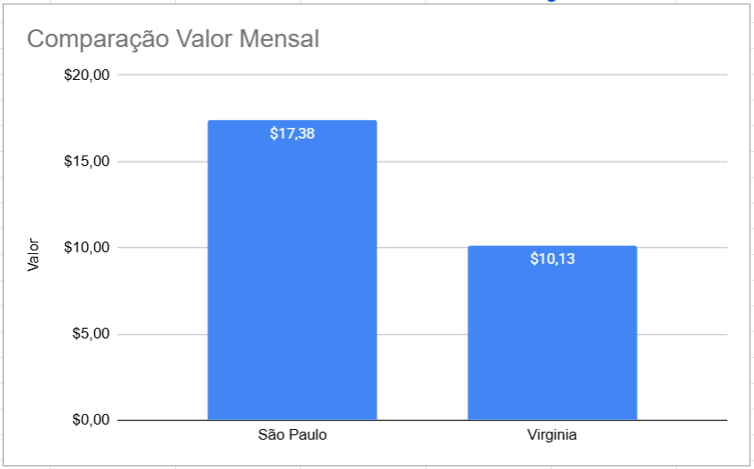

# Fase 5 - Cap 1 - FarmTech na Era da Cloud Computing

## Identificação

**Fase:** 5
**Capítulo:** 1
**Grupo:** H.M.N.R.V.
**Entregável:** 1

---

## Descrição da Atividade

O projeto tem como objetivo utilizar técnicas de **Ciência de Dados e Machine Learning** para analisar condições ambientais de uma produção agrícola e prever o **rendimento das culturas**.

O desafio consiste em explorar os dados disponíveis, identificar padrões e agrupamentos nas condições de cultivo e comparar diferentes algoritmos de regressão para determinar sua capacidade de prever a produtividade das safras.

---

## Bibliotecas Utilizadas

As principais bibliotecas utilizadas no projeto são:

* **Pandas** — manipulação e análise dos dados;
* **NumPy** — operações numéricas;
* **Matplotlib** — visualização dos dados;
* **Scikit-learn** — pré-processamento, clusterização, treinamento, validação e avaliação dos modelos.

Entre os algoritmos utilizados estão **K-Means, DBSCAN, KNN, Random Forest, Regressão Linear, Decision Tree e SVR**.

---

## Como Executar o Notebook

Para executar o projeto corretamente, siga os passos abaixo:

### 1. Baixe os arquivos

Faça o download dos dois arquivos disponíveis neste repositório:

* `MarcoSiqueira_rm569975_pbl_fase4.ipynb`
* `crop_yield.csv`

O arquivo `.csv` é o dataset utilizado pelo notebook e deve estar disponível para que os códigos consigam carregar os dados.

### 2. Abra o notebook

O notebook pode ser executado utilizando **Jupyter Notebook, JupyterLab ou Google Colab**.

Caso utilize o Google Colab, faça o upload do arquivo `.ipynb` e, quando solicitado pelo notebook, disponibilize o arquivo `crop_yield.csv`.

### 3. Execute as células

Execute as células do notebook **na ordem em que aparecem**, começando pela primeira e seguindo até a conclusão.

As células já possuem os códigos e resultados necessários para reproduzir a análise realizada pelo grupo.

---

## Integrantes

* Heitor Exposito de Sousa - RM 566013
* Marco Antônio Rodrigues Siqueira - RM 569975
* Nádia Nakamura Vieira - RM 568906
* Rafael Bassani - RM 569930
* Vinicius Xavier da Silva - RM 572108

---

## Métodos Utilizados

### Clusterização

Para identificar agrupamentos nas condições ambientais, foram utilizados os algoritmos **K-Means** e **DBSCAN**. Os dados são previamente padronizados para que as diferentes escalas das variáveis não distorçam o agrupamento.

### Modelos Preditivos

Foram comparados cinco algoritmos de regressão: **KNN, Random Forest, Regressão Linear, Decision Tree e SVR**.

O treinamento utiliza **Pipelines**, integrando o pré-processamento ao modelo e evitando vazamento de dados. A comparação dos modelos é realizada utilizando **validação cruzada**, permitindo avaliar seu desempenho de forma mais robusta.

Os modelos são avaliados principalmente pelas métricas **R², MAE e RMSE**.

---

## Conclusões entrega 1

A análise permitiu identificar padrões nas condições ambientais por meio de técnicas de clusterização e comparar diferentes abordagens de Machine Learning para previsão do rendimento agrícola.

Entre os modelos avaliados, o **KNN apresentou o melhor desempenho médio na validação cruzada**, sendo selecionado como modelo final segundo o critério estabelecido no projeto. A análise também mostrou que a **Regressão Linear apresentou desempenho competitivo no conjunto de teste**.

O projeto demonstra a aplicação de técnicas de análise de dados e Machine Learning como ferramentas de apoio à compreensão e previsão da produtividade agrícola.

## Conclusões entrega 2
Apesar de a região da Virgínia apresentar o menor custo mensal, com aproximadamente US$ 10,13 contra US$ 17,38 em São Paulo, a escolha mais adequada para o projeto é a região de São Paulo.

Essa decisão ocorre porque o cenário proposto considera restrições legais para o armazenamento de dados no exterior. Dessa forma, mesmo com um custo maior, manter a infraestrutura na região brasileira permite que os dados permaneçam armazenados no país, atendendo aos requisitos de residência e governança da informação.

Além disso, como os dados dos sensores serão gerados e acessados no Brasil, a utilização da região de São Paulo também tende a proporcionar menor latência no envio e no processamento das informações.

Portanto, a região de São Paulo foi escolhida mesmo sendo mais cara, pois atende melhor aos requisitos legais e operacionais da solução.

---

## Vídeos Demonstrativos

### Entregável 1

[Assista ao vídeo demonstrativo no YouTube](https://youtu.be/TltNFFdmXj4)
[Acesse o Notebook no Google Colab](https://colab.research.google.com/drive/1BzJ0NwZATXmh-Px8Lpfq43qDlyaQgM6K?usp=sharing)

### Entregável 2
[Assista ao vídeo demonstrativo no YouTube](https://youtu.be/dFYQ8A1YnpE)

---

## Arquivos

* `MarcoSiqueira_rm569975_pbl_fase4.ipynb` — Notebook contendo o desenvolvimento do projeto.
* `crop_yield.csv` — Dataset utilizado na atividade.

---

## Ir Além
